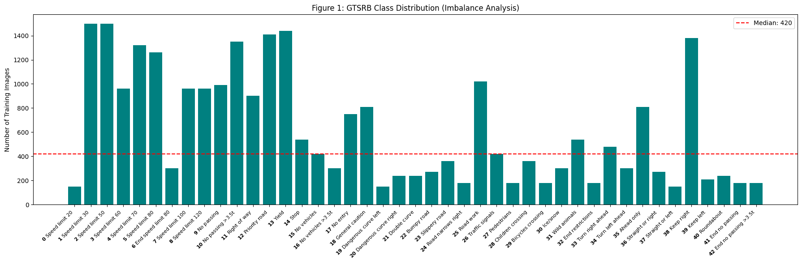
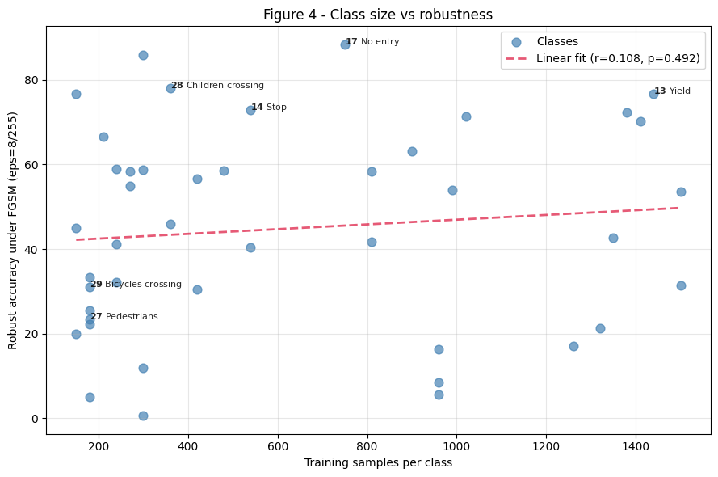
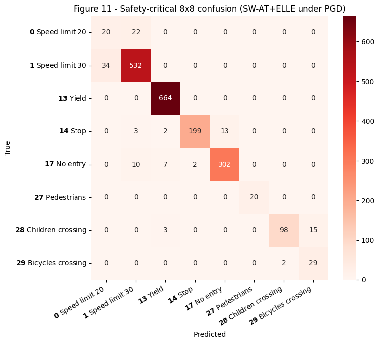
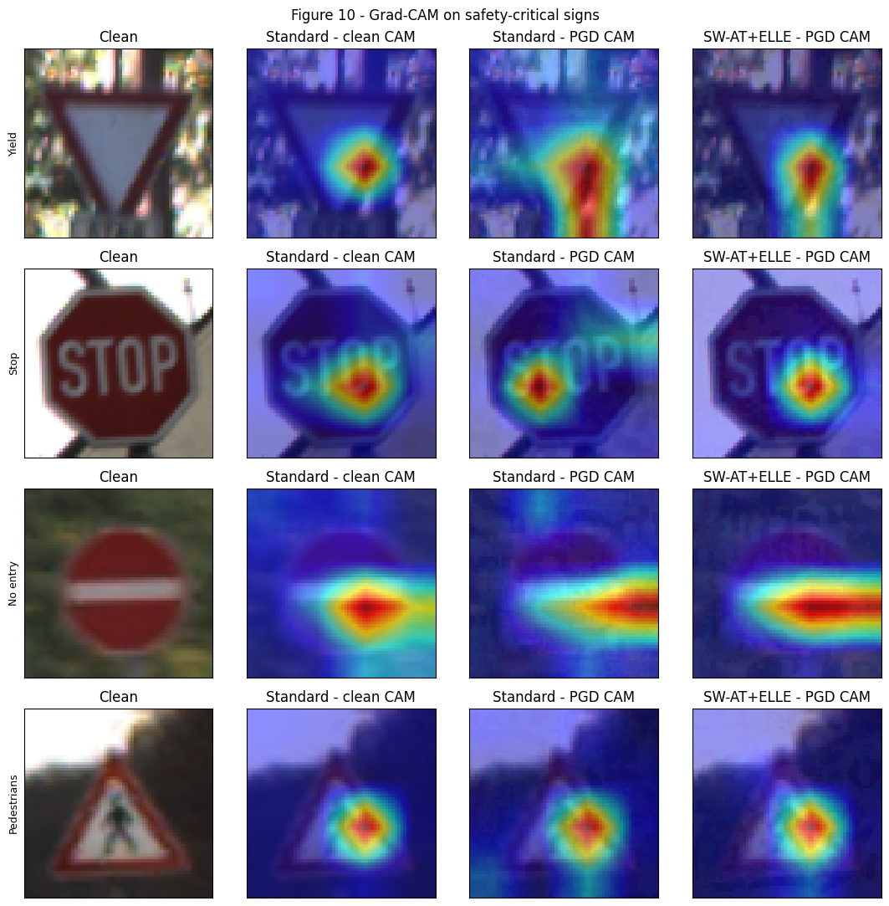

<div align="center">

# Safety-Weighted Adversarial Training for Traffic Sign Recognition

Adversarial attacks, adversarial training and safety-aware evaluation on GTSRB

<b>Tools:</b> PyTorch | GTSRB | FGSM/PGD | Grad-CAM | Kaggle (T4 GPU)<br>
<b>Authors:</b> Asmar Aliyeva, Ilaha Mustafayeva, Nazrin Abdullayeva<br>
<b>Affiliation:</b> French-Azerbaijani University (UFAZ)<br>
<b>Supervisor:</b> Prof. Rauf Fatali<br>
<b>Period:</b> April – May 2026

<br>


<sub>A Stop sign classified with 99.9% confidence is misclassified as "Speed limit 120" (98.5%) after a PGD-20 perturbation of ε = 8/255.</sub>

</div>

---

## Overview

This project continues our earlier work on [adversarial robustness on CIFAR-10](https://github.com/AsmarAlv/ai_project). That project ended with two open points: it was evaluated with FGSM only, and its FGSM-trained model showed signs of catastrophic overfitting. Here we move to a more realistic setting, the German Traffic Sign Recognition Benchmark (GTSRB), where a wrong prediction can have direct safety consequences, and extend the study with a stronger attack (PGD-20), more adversarial training methods, and a safety-aware evaluation.

On the road, not all mistakes are equally dangerous: misreading a Stop sign is far worse than misreading a "Road work" sign. Besides standard accuracy, we therefore define a four-tier safety taxonomy and a severity-weighted error metric (WSCER), and test whether weighting the training loss by safety severity improves robustness where it matters most.

The project covers:

1. ResNet-18 and MobileNetV2 baselines trained on GTSRB with a class-balanced loss.
2. FGSM and PGD-20 attacks implemented from scratch and checked against torchattacks.
3. Four adversarially trained ResNet-18 models: FGSM-AT, PGD-AT, FGSM-AT with an ELLE-style regularizer, and SW-AT+ELLE, which also weights the loss by safety severity.
4. Evaluation with accuracy, macro-F1 and WSCER, plus Grad-CAM, class-size analysis and black-box transferability to MobileNetV2.

## Safety taxonomy and WSCER

| Severity | Weight | Classes |
|---|:---:|---|
| Fatal | 4 | Stop, No entry |
| Dangerous | 3 | Yield, Pedestrians, Children crossing, Bicycles crossing |
| Moderate | 2 | Speed limits |
| Minor | 1 | All other signs |

WSCER (Weighted Safety-Critical Error Rate) weights each misclassified test image by the severity of its true class:

$$\text{WSCER} = \frac{\sum_i w_{y_i}\,\mathbb{1}[\hat{y}_i \neq y_i]}{\sum_i w_{y_i}}$$

It ranges from 0 (no errors) to 1 (every image wrong). A mistake on a Stop sign counts four times as much as a mistake on a minor sign.

## Results

All attacks are L∞ with ε = 8/255 in pixel space. The test set has 12,630 images.

| Model | Clean | FGSM | PGD-20 | WSCER (PGD-20) | Macro-F1 (PGD-20) |
|---|:---:|:---:|:---:|:---:|:---:|
| Standard ResNet-18 | 98.40 | 46.71 | 11.31 | 0.871 | 0.121 |
| FGSM-AT | 92.09 | 74.24 | 52.88 | 0.452 | 0.503 |
| FGSM-AT + ELLE | 91.77 | 71.71 | 50.52 | 0.475 | 0.484 |
| SW-AT + ELLE | 91.46 | 71.27 | 50.87 | 0.467 | 0.485 |
| PGD-AT | 87.67 | 66.85 | 58.54 | 0.401 | 0.575 |

Accuracy in %. Lower WSCER is safer.

<table>
  <tr>
    <td width="55%"></td>
    <td width="45%"></td>
  </tr>
  <tr>
    <td align="center"><sub>Accuracy on clean, FGSM and PGD-20 inputs</sub></td>
    <td align="center"><sub>WSCER under PGD-20</sub></td>
  </tr>
</table>

### Standard model under different budgets

| ε | 0 | 2/255 | 4/255 | 8/255 | 16/255 | 32/255 |
|---|:---:|:---:|:---:|:---:|:---:|:---:|
| FGSM | 98.40 | 80.81 | 65.60 | 46.71 | 30.12 | 17.38 |
| PGD-20 | 98.40 | 62.85 | 34.22 | 11.12 | 0.81 | 0.00 |

PGD uses a random start, so the value at ε = 8/255 differs slightly between this sweep (11.12%) and the main table (11.31%).

<table>
  <tr>
    <td width="50%"></td>
    <td width="50%"></td>
  </tr>
  <tr>
    <td align="center"><sub>FGSM and PGD-20 on the standard model</sub></td>
    <td align="center"><sub>Grad-CAM on a Stop sign. Rows: Standard, FGSM-AT, PGD-AT. Columns: clean, FGSM, PGD-20</sub></td>
  </tr>
</table>

<details>
<summary><b>More figures</b></summary>

<br>

| | |
|---|---|
|  |  |
| <sub>GTSRB class distribution</sub> | <sub>Class size vs. robust accuracy under FGSM</sub> |
|  |  |
| <sub>Confusion among safety-critical classes, SW-AT+ELLE under PGD-20</sub> | <sub>Grad-CAM on safety-critical signs: standard vs. SW-AT+ELLE</sub> |

All figures are in [`results/figures/`](results/figures/) and the result tables in [`results/tables/`](results/tables/).

</details>

## Discussion

**Vulnerability of the standard model.** The standard ResNet-18 reaches 98.40% on clean images but only 11.31% under PGD-20. Even at ε = 2/255 its PGD accuracy falls to 62.85%.

**Effect of adversarial training.** All four adversarially trained models are far more robust: PGD-20 accuracy rises to 50.5–58.5% at 87.7–92.1% clean accuracy, and WSCER drops from 0.87 to 0.40–0.48. PGD-AT is the most robust and has the lowest WSCER, but also the largest drop in clean accuracy.

**FGSM-AT and the ELLE-style regularizer.** Unlike in our CIFAR-10 project, FGSM-AT did not show catastrophic overfitting here: it keeps 52.88% under PGD-20. The ELLE-style regularizer, which is meant to prevent catastrophic overfitting, therefore had little to fix, and FGSM-AT+ELLE ends slightly below plain FGSM-AT (50.52% vs. 52.88%). It was still 1.53 times faster to train than PGD-AT (72 vs. 110 minutes).

**Safety weighting.** Weighting the loss by safety severity gave only a marginal improvement over uniform weighting with the same regularizer (WSCER 0.467 vs. 0.475) and did not outperform plain FGSM-AT.

**Other observations.** Class size and robust accuracy are not significantly correlated (Pearson r = 0.108, p = 0.49), so rare classes are not systematically more vulnerable. Adversarial errors do not flow toward the most frequent classes either: only 12–22% of them land in the five largest classes, below their 27% share of the training data. Finally, PGD examples crafted on ResNet-18 reduce MobileNetV2 accuracy from 96.20% to 72.15% without any access to MobileNetV2.

## Method

**Data.** GTSRB through torchvision (26,640 training and 12,630 test images, 43 classes), resized to 64×64 and normalized. Training augmentation: random crop with padding 4, rotation of ±15° and colour jitter.

**Baselines.** Standard torchvision ResNet-18 and MobileNetV2 trained from scratch for 30 epochs with SGD (learning rate 0.1, momentum 0.9, weight decay 5e-4), cosine annealing, batch size 32, and cross-entropy weighted by inverse class frequency.

**Attacks.** Inputs are converted back to pixel space, perturbed, clipped to [0, 1] and normalized again, so ε is a pixel-space budget. FGSM takes one step of size ε. PGD-20 takes 20 steps of size ε/4 from a random start in the ε-ball. Both give the same results as torchattacks.

**Adversarial training.** ResNet-18, 50 epochs, same optimizer, ε = 8/255, trained on adversarial examples only.

| Model | Inner attack | Loss |
|---|---|---|
| FGSM-AT | FGSM | Cross-entropy |
| PGD-AT | PGD-7, random start | Cross-entropy |
| FGSM-AT + ELLE | FGSM | Cross-entropy + λ · ELLE-style penalty (λ = 10) |
| SW-AT + ELLE | FGSM | Safety-weighted cross-entropy (4/3/2/1) + λ · ELLE-style penalty |

The ELLE-style penalty takes a random point on the line between the clean and the FGSM input and penalizes how far the model's logits at that point are from the linear interpolation of the logits at both ends. For each model we keep the epoch with the best severity-weighted F1 under the training attack, and track the recall of the fatal classes during training.

## How to run

The notebook was run on Kaggle with a T4 GPU.

1. Import `gtsrb_safety_weighted_at.ipynb` into a Kaggle notebook and turn on GPU and Internet.
2. To reuse the trained models, attach the dataset [asmaraliyeva/gtsrb-weights](https://www.kaggle.com/datasets/asmaraliyeva/gtsrb-weights) and keep `USE_CHECKPOINTS = True`. Training cells are then skipped.
3. To train from scratch, set `USE_CHECKPOINTS = False`. Each adversarially trained model takes about 1–2 hours on a T4.
4. Run all cells. GTSRB is downloaded automatically.

To run locally, install the dependencies with `pip install -r requirements.txt` and change the `/kaggle/...` paths at the top of the notebook.

```
├── gtsrb_safety_weighted_at.ipynb
├── config.yaml
├── requirements.txt
└── results/
    ├── figures/
    └── tables/
```

Model weights are not included in the repository.

## Limitations

- There is no separate validation split, so the best epoch is chosen on the test set. The reported numbers may be slightly optimistic.
- The regularizer is a variant of ELLE (Abad Rocamora et al., 2024): it uses the logits between the clean and FGSM points instead of the loss at points in the ε-ball, and λ was not tuned.
- Only FGSM and PGD-20 were used; stronger attacks such as AutoAttack were not evaluated.
- All results come from a single run (seed 42), so differences of about one percentage point between models may not hold across seeds.
- The safety taxonomy was defined by us and is meant as a proof of concept, not an official risk classification.

## References

- Goodfellow, Shlens & Szegedy (2015). Explaining and harnessing adversarial examples. *ICLR*.
- Madry, Makelov, Schmidt, Tsipras & Vladu (2018). Towards deep learning models resistant to adversarial attacks. *ICLR*.
- Wong, Rice & Kolter (2020). Fast is better than free: Revisiting adversarial training. *ICLR*.
- Abad Rocamora, Liu, Chrysos, Olmos & Cevher (2024). Efficient local linearity regularization to overcome catastrophic overfitting. *ICLR*.
- Stallkamp, Schlipsing, Salmen & Igel (2012). Man vs. computer: Benchmarking machine learning algorithms for traffic sign recognition. *Neural Networks*, 32.
- Selvaraju et al. (2017). Grad-CAM: Visual explanations from deep networks via gradient-based localization. *ICCV*.
- Kim (2020). Torchattacks: A PyTorch repository for adversarial attacks. *arXiv:2010.01950*.
