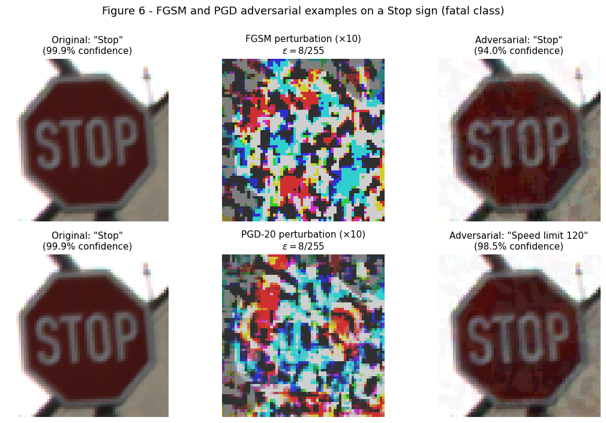
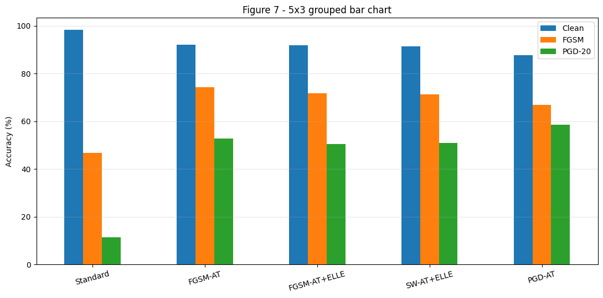
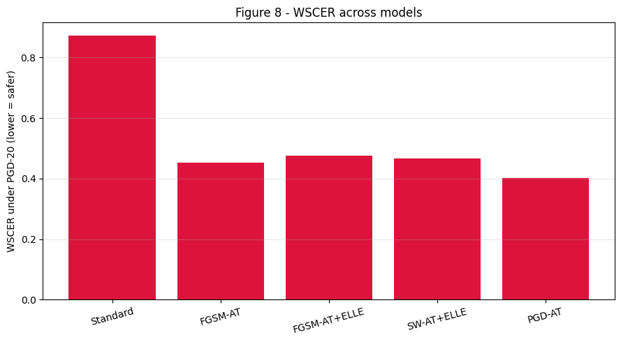
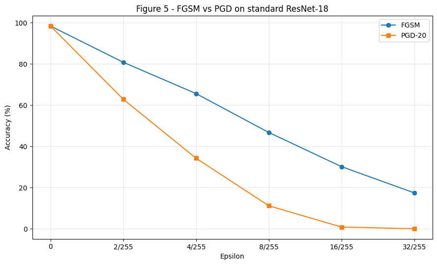
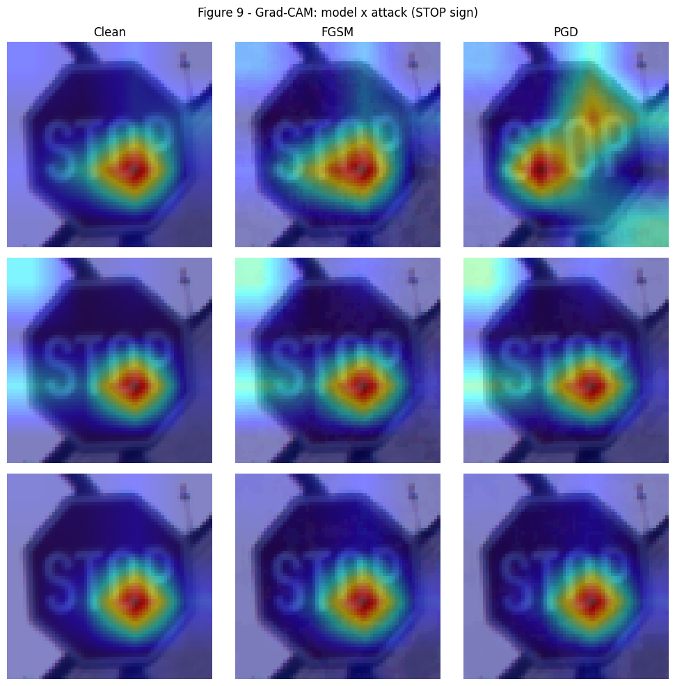

# Safety-Weighted Adversarial Training for Traffic Sign Recognition

Adversarial robustness of traffic sign classifiers on **GTSRB** (German Traffic Sign Recognition Benchmark), evaluated with a focus on *which* mistakes matter. Misreading a Stop sign is far more dangerous than misreading a "Road work" sign, so besides standard accuracy this project introduces a four-tier safety taxonomy and a severity-weighted error metric (**WSCER**), and tests whether weighting the training loss by safety severity improves robustness where it matters most.

**Authors:** Asmar Aliyeva, Ilaha Mustafayeva, Nazrin Abdullayeva
**Affilation:** French-Azerbaijani University (UFAZ)
**Supervisor:** Prof. Rauf Fatali
**Period:** April – May 2026

<p align="center">
  
</p>

*A correctly classified Stop sign (99.9% confidence) is misclassified as "Speed limit 120" (98.5% confidence) after a PGD-20 perturbation of ε = 8/255.*

---

## Overview

The project covers five steps:

1. **Baselines.** ResNet-18 (Model A) and MobileNetV2 (Model B) trained on GTSRB with class-balanced loss.
2. **Attacks.** FGSM and PGD-20, both implemented from scratch in pixel space and verified against [torchattacks](https://github.com/Harry24k/adversarial-attacks-pytorch) (identical outputs, max pixel difference 0.000000).
3. **Adversarial training.** Four ResNet-18 variants: FGSM-AT, PGD-AT, FGSM-AT with an ELLE-style local-linearity regularizer, and **SW-AT+ELLE**, which adds safety-severity class weights to the loss.
4. **Safety-aware evaluation.** Every model is evaluated on clean, FGSM and PGD-20 inputs with accuracy, macro-F1 and WSCER, and a focused confusion matrix on safety-critical classes.
5. **Analysis.** Class size vs. robustness, direction of adversarial errors, Grad-CAM, and black-box transferability from ResNet-18 to MobileNetV2.

## Safety taxonomy and WSCER

Each of the 43 classes is assigned a severity weight:

| Group | Weight | Classes |
|---|---|---|
| Fatal | 4 | Stop (14), No entry (17) |
| Dangerous | 3 | Yield (13), Pedestrians (27), Children crossing (28), Bicycles crossing (29) |
| Moderate | 2 | Speed limits (0–5, 7, 8) |
| Minor | 1 | All other classes |

**WSCER (Weighted Safety-Critical Error Rate)** weights every misclassified test sample by the severity of its true class:

$$\text{WSCER} = \frac{\sum_i w_{y_i}\,\mathbb{1}[\hat{y}_i \neq y_i]}{\sum_i w_{y_i}}$$

0 means no errors and 1 means every sample is wrong. An error on a Stop sign counts four times as much as an error on a minor sign.

## Results

All attacks use ε = 8/255 (L∞, pixel space). The test set has 12,630 images.

### Accuracy (%)

| Model | Clean | FGSM | PGD-20 |
|---|---|---|---|
| Standard ResNet-18 | **98.40** | 46.71 | 11.31 |
| FGSM-AT | 92.09 | **74.24** | 52.88 |
| FGSM-AT + ELLE | 91.77 | 71.71 | 50.52 |
| SW-AT + ELLE | 91.46 | 71.27 | 50.87 |
| PGD-AT | 87.67 | 66.85 | **58.54** |

### Safety and class-balanced metrics under PGD-20

| Model | WSCER ↓ | Macro-F1 ↑ |
|---|---|---|
| Standard ResNet-18 | 0.871 | 0.121 |
| FGSM-AT | 0.452 | 0.503 |
| FGSM-AT + ELLE | 0.475 | 0.484 |
| SW-AT + ELLE | 0.467 | 0.485 |
| PGD-AT | **0.401** | **0.575** |

<p align="center">
  
  
</p>

### Key findings

- **The standard model is highly vulnerable.** Clean accuracy of 98.40% drops to 11.31% under PGD-20. Even ε = 2/255 lowers it to 62.85%.
- **All adversarial training variants help substantially.** PGD-20 accuracy rises to 50.5–58.5% at 87.7–92.1% clean accuracy, and WSCER roughly halves (0.87 → 0.40–0.48).
- **PGD-AT is the most robust** (58.54% PGD-20, lowest WSCER), at the highest clean-accuracy cost.
- **FGSM-AT did not show catastrophic overfitting** here: it keeps 52.88% under PGD-20.
- **The ELLE-style regularizer did not improve robustness in this setting.** FGSM-AT+ELLE is slightly worse than plain FGSM-AT (50.52% vs. 52.88% PGD-20), which is consistent with the previous point: without catastrophic overfitting, there was little for the regularizer to fix. It was still 1.53× faster to train than PGD-AT (71.6 vs. 109.6 min).
- **Safety weighting gave only a marginal gain** over uniform weighting with the same regularizer (WSCER 0.467 vs. 0.475, PGD-20 50.87% vs. 50.52%), and did not outperform plain FGSM-AT.
- **Class frequency does not predict robustness.** Per-class FGSM robust accuracy is not significantly correlated with training set size (Pearson r = 0.108, p = 0.49).
- **Adversarial errors do not flow toward frequent classes.** Only 12–22% of adversarial misclassifications land in the five most frequent classes, below their 27% share of the training data.
- **Attacks transfer across architectures.** PGD-20 examples crafted on ResNet-18 reduce MobileNetV2 accuracy from 96.20% to 72.15% without any access to MobileNetV2.

### FGSM vs. PGD on the standard model

| ε | 0 | 2/255 | 4/255 | 8/255 | 16/255 | 32/255 |
|---|---|---|---|---|---|---|
| FGSM | 98.40 | 80.81 | 65.60 | 46.71 | 30.12 | 17.38 |
| PGD-20 | 98.40 | 62.85 | 34.22 | 11.12 | 0.81 | 0.00 |

*PGD uses a random start, so the ε = 8/255 value differs slightly between this sweep (11.12%) and the evaluation matrix (11.31%).*

<p align="center">
  
</p>

### Grad-CAM

<p align="center">
  
</p>

*Grad-CAM on a Stop sign. Rows: Standard, FGSM-AT, PGD-AT. Columns: clean, FGSM, PGD-20 input.*

More figures (class distribution, confusion matrices, training histories, safety-critical confusion submatrix) are in [`results/figures/`](results/figures/), and all result tables are in [`results/tables/`](results/tables/).

## Method

**Data.** GTSRB via `torchvision.datasets.GTSRB` (26,640 training and 12,630 test images, 43 classes), resized to 64×64 and normalized with the dataset mean and standard deviation. Training augmentation: random crop (padding 4), rotation ±15°, and color jitter.

**Baselines.** Standard torchvision ResNet-18 and MobileNetV2, trained from scratch for 30 epochs with SGD (lr 0.1, momentum 0.9, weight decay 5e-4, cosine annealing, batch size 32) and cross-entropy weighted by inverse class frequency to counter class imbalance.

**Attacks.** Both attacks convert normalized inputs back to pixel space, perturb there, clip to [0, 1] and re-normalize, so ε is a true pixel-space budget.
- FGSM: single step of size ε.
- PGD-20: 20 steps, step size ε/4, random start in the ε-ball.

**Adversarial training.** ResNet-18, 50 epochs, same optimizer settings, ε = 8/255, trained on adversarial examples only.

| Model | Inner attack | Loss |
|---|---|---|
| FGSM-AT | FGSM | Cross-entropy |
| PGD-AT | PGD-7, random start | Cross-entropy |
| FGSM-AT + ELLE | FGSM | Cross-entropy + λ · ELLE-style penalty (λ = 10) |
| SW-AT + ELLE | FGSM | Safety-weighted cross-entropy (weights 4/3/2/1) + λ · ELLE-style penalty (λ = 10) |

The ELLE-style penalty samples a random point on the line between the clean and FGSM input and penalizes the deviation of the model's logits from the linear interpolation of the logits at both ends.

**Checkpoint selection.** For each adversarially trained model, the epoch with the best severity-weighted F1 under the training attack is kept. Fatal-class recall is tracked during training as an additional safety check.

## Repository structure

```
├── gtsrb_safety_weighted_at.ipynb   # full pipeline: data, training, attacks, evaluation, figures
├── config.yaml                      # dataset and training hyperparameters
├── requirements.txt
└── results/
    ├── figures/                     # all figures produced by the notebook
    └── tables/                      # evaluation matrix, WSCER, macro-F1, attack sweep (CSV)
```

## How to run

The notebook was developed and run on **Kaggle** with a Tesla T4 GPU.

1. Create a Kaggle notebook, import `gtsrb_safety_weighted_at.ipynb`, and enable **GPU T4** and **Internet** in the settings.
2. **To reuse trained weights:** attach the Kaggle dataset with the checkpoints ([asmaraliyeva/gtsrb-weights](https://www.kaggle.com/datasets/asmaraliyeva/gtsrb-weights)) and keep `USE_CHECKPOINTS = True`. Training cells are then skipped and all evaluations run on the saved models.
3. **To train from scratch:** set `USE_CHECKPOINTS = False`. Each adversarially trained model takes roughly 1–2 hours on a T4 (e.g. PGD-AT ≈ 110 min, FGSM-AT+ELLE ≈ 72 min).
4. Run all cells. GTSRB is downloaded automatically.

To run locally instead, install the dependencies with `pip install -r requirements.txt` and change the `/kaggle/...` paths at the top of the notebook.

Model weights (~225 MB) are not stored in this repository.

## Limitations

- **Checkpoint selection uses the test set.** There is no separate validation split, so the best epoch of each model is chosen using test-set metrics. Reported numbers may therefore be slightly optimistic.
- **The regularizer is a variant of ELLE**, not the original method: it penalizes non-linearity of the *logits* between the clean and FGSM points, while ELLE (Abad Rocamora et al., 2024) penalizes non-linearity of the *loss* between points sampled in the ε-ball. λ was fixed at 10 without tuning.
- **Evaluation uses FGSM and PGD-20 only.** Stronger or parameter-free attacks such as AutoAttack were not evaluated.
- **Single run per model** (seed 42), so differences of about 1 percentage point between models (e.g. SW-AT+ELLE vs. FGSM-AT+ELLE) are within the range that could change across seeds.
- **The safety taxonomy is author-defined** and meant as a proof of concept, not an official risk classification.

## References

- Goodfellow, I. J., Shlens, J., & Szegedy, C. (2015). Explaining and harnessing adversarial examples. *ICLR*.
- Madry, A., Makelov, A., Schmidt, L., Tsipras, D., & Vladu, A. (2018). Towards deep learning models resistant to adversarial attacks. *ICLR*.
- Wong, E., Rice, L., & Kolter, J. Z. (2020). Fast is better than free: Revisiting adversarial training. *ICLR*.
- Abad Rocamora, E., Liu, F., Chrysos, G. G., Olmos, P. M., & Cevher, V. (2024). Efficient local linearity regularization to overcome catastrophic overfitting. *ICLR*.
- Stallkamp, J., Schlipsing, M., Salmen, J., & Igel, C. (2012). Man vs. computer: Benchmarking machine learning algorithms for traffic sign recognition. *Neural Networks*, 32, 323–332.
- Selvaraju, R. R., et al. (2017). Grad-CAM: Visual explanations from deep networks via gradient-based localization. *ICCV*.
- Kim, H. (2020). Torchattacks: A PyTorch repository for adversarial attacks. *arXiv:2010.01950*.
